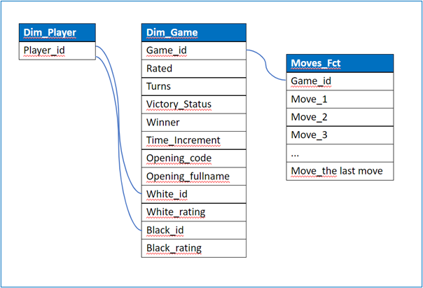
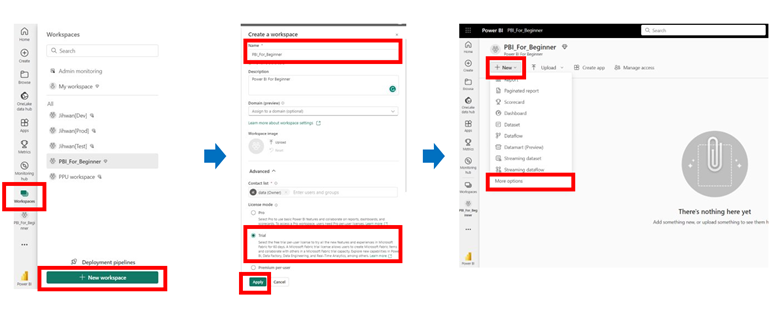
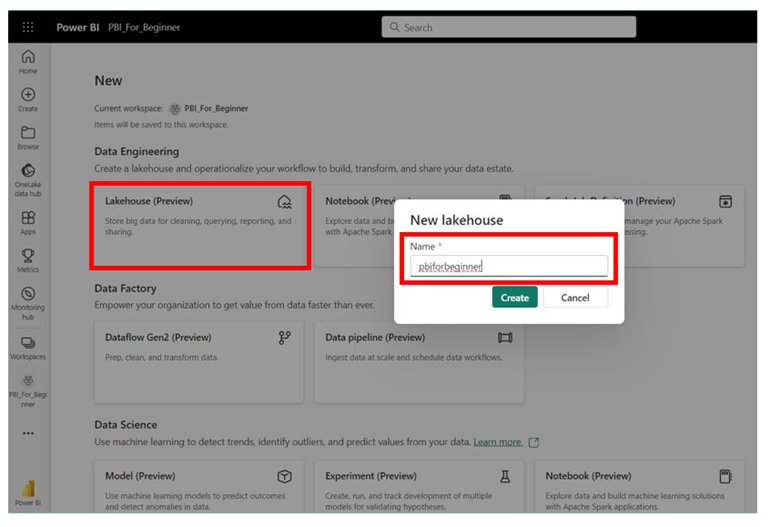
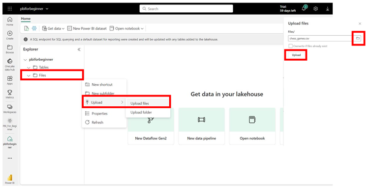

# Power BI

   - Understanding data visualization principles and best practices.
   - Connecting to various data sources and transforming data.
   - Creating interactive reports and dashboards.
   - Implementing data modeling and calculations.
   - Sharing and collaborating on Power BI content.

# 24th September 2023 update
- Link: https://1drv.ms/w/s!AvmCO4Wm--vEvDbk_NlM7Aw5hh1h?e=hwEut5

**Sample data:** Online Chess Games

It is an open source that I get from Mavenanalytics.io Link to the website: https://mavenanalytics.io/data-playground?page=5&pageSize=5 Link to the file: [Chess Games](https://onedrive.live.com/redir?resid=C4EBFBA6853B82F9!7737&authkey=!AIN9IERgYYcQwUg&e=Pu7MIA)

## Purpose of the course

This course is designed to provide guidance systematically through the fundamentals of Power BI. Several key concepts, but only the basics, will be illustrated using the sample dataset, and by the end of the course, we will have constructed a Power BI report. You can actively participate in the tutorial by downloading the dataset from the link above. The datamodel and the process to create the analysis report that are described in this course is not an absolute and the only solution, but there might be several different ways to have the same result.

## What Is Power BI?

Power Business Intelligence (BI) is a tool that enables you to establish connections with various data sources, visualize data through reports and dashboards, and subsequently distribute them to the individuals of your choice.

## Power BI consists of three primary components:

1. Power BI Desktop: This is a no-cost desktop application for creating and designing reports.

2. Power BI Service: It's an online publishing service for viewing and sharing reports and dashboards.

3. Power BI mobile apps: These apps facilitate the access and viewing of reports and dashboards while you're on the move.

In this course, I will focus on creating and connecting to the source (Lakehouse), creating and designing a report in the Power BI Desktop, and very briefly about how to share it via Power BI Service.

You need to register and have Power BI Service ID/PW in order to move the CSV file from the local machine to Lakehouse as a source.

## What Is the Purpose of Power BI?

Power BI belongs to the realm of Business Intelligence (BI) tools. The overarching goal of BI is to monitor Key Performance Indicators (KPIs) and unveil valuable insights within business data, enhancing decision-making processes throughout the entire organization.

The utilization of Power BI varies according to individual roles, encompassing developers, analysts, managers, directors, and all other personnel within an organization.

## Suggested Analyses by using the sample data:

What to show in the analysis report is communicated frequently and shared with end users before we start to create the Power BI report.

We, as a Power BI Report developer, have to share with end users about,

- What users want to see in the report

- What users need to see in the report

- What values and insights users can get from the report

By using the sample data, I pretend and assume that I had conversations with users a few times about what we agreed to see on the report, and those are,

1. What is the next best move to win the game, and what is the winning percentage of the move based on the historical data that we have (the data has 20,051 games information)?

2. What proportion of games were secured by the white player, and how many concluded as draws?

3. Which initial chess move was employed most frequently in games where black emerged victorious? Conversely, what was the prevalent opening move in games where white emerged as the winner?

4. What percentage of games were won by the participant with the superior rating? Is there any variance in this statistic based on the color of pieces?

5. Who is the user with the highest number of game wins? What percentage of these victories did the user achieve as the higher-rated player?

**Draw a datamodel:**

After having conversation with stakeholders, the insights that need be shown by the analysis are,

- Win or lose by which players

- Win or lose by which next moves in games

-> The dimension tables contain information about the Players and Games.

-> The fact table contains information about Moves.

-> The drawing of the datamodel looks like below. The below datamodel can be changed or amended based on what data is in the source.

**Store the source in Lakehouse:** 
1.	The source is given as a CSV file. I decide to store this source data in Lakehouse, and I plan to use Dataflow Gen2 to transform the source table.
2.	Create a workspace in app.powerbi.com
3.	Name the new workspace “PBI_For_Beginner”.

4.	Create Lakehouse, and name it as “pbiforbeginner”.

5. Upload the CSV file

6.	Now, the file is in the Lakehouse. 
7.	Load it to the table.
